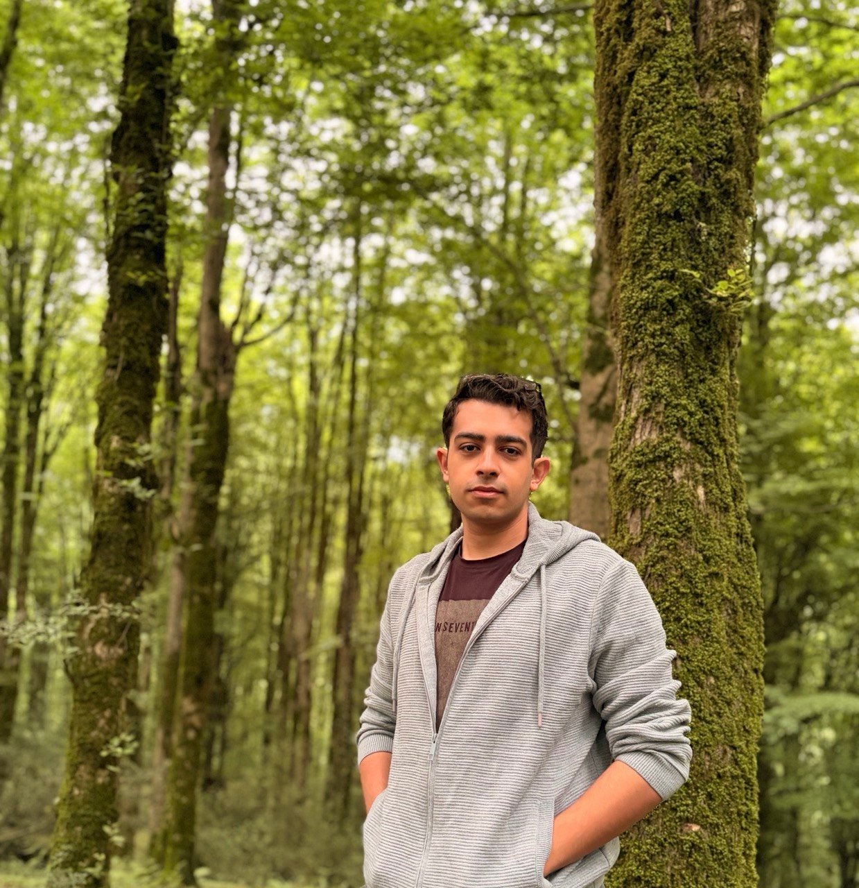

<div align="center">



<br>

[](https://git.io/typing-svg)

[](https://www.linkedin.com/in/parham-kiyoumarsi-a36219397/)
[](mailto:parham.kiyoumarsi@mehr.ui.ac.ir)
[](https://github.com/parhamKIY)

</div>

## `whoami`

```python
parham = {
    "role": "Computer Engineering Student",
    "university": "University of Isfahan",
    "focus": ["Artificial Intelligence", "Deep Learning", "Computer Networks"],
    "interests": ["Cybersecurity", "IoT", "Data Mining", "Digital Signal Processing"],
    "research": "Two peer-reviewed publications",
    "mindset": "Learn deeply. Build thoughtfully. Share openly."
}
```

I am a Computer Engineering student focused on **Artificial Intelligence**, with an academic background in **computer networks**. I enjoy connecting research with implementation—especially where machine learning meets cybersecurity, IoT, data mining,Bioinformatics and signal processing.

My experience includes publishing peer-reviewed research, mentoring students as a teaching assistant, and building practical systems that move from raw data to useful outcomes.

## Tech stack

<div align="center">

### Languages & data


### AI & machine learning


### Systems & domains


</div>

## Research & publications

<table>
  <tr>
    <td width="50%">
      <h3>Trust in IoT Networks</h3>
      <p>
        <strong>Providing a Method to Improve the Level of Trust in IoT Networks Using Deep Learning Structure</strong>
      </p>
      <a href="https://srb.sanad.iau.ir/en/Article/1194560">
        
      </a>
    </td>
    <td width="50%">
      <h3>Cancer Classification</h3>
      <p>
        <strong>A Feature Selection Method on Gene Expression Microarray Data for Cancer Classification</strong>
      </p>
      <a href="https://srb.sanad.iau.ir/fa/Article/1189068">
        
      </a>
    </td>
  </tr>
</table>

## Academic experience

### Teaching Assistant — Fundamentals of Computer Programming

**University of Isfahan**

- Mentored undergraduate students in core programming concepts.
- Helped students strengthen algorithmic thinking and problem-solving skills.

### B.Sc. in Computer Engineering

**University of Isfahan**

- Primary focus: Artificial Intelligence
- Secondary focus: Computer Networks

## Continuous learning

- Advanced Python Programming
- Academic Writing with AI
- English Language Proficiency — Advanced
- Ongoing exploration of deep learning, encryption, data mining, and intelligent connected systems

## GitHub activity

<div align="center">


</div>

<div align="center">

### Research-driven. Curious by default. Always building.

My pinned repositories below are the best place to explore what I have been working on.

</div>


